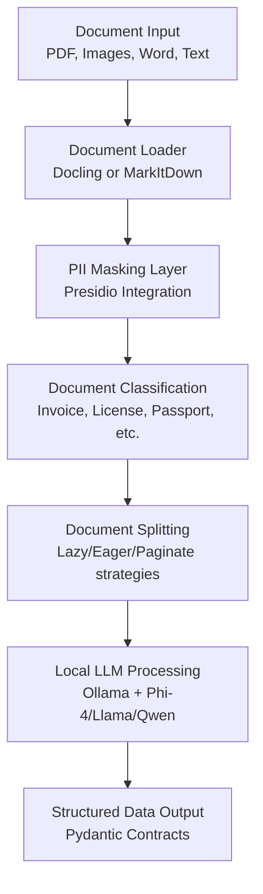

# Document Intelligence with Local LLMs

This module provides privacy-preserving document intelligence capabilities using local LLMs (Ollama + Phi-4) and advanced document processing libraries (Docling/MarkItDown).

## 🎯 Key Features

- **Local Processing**: All processing happens on-premise using Ollama and/or Hugging Face models
- **Multi-Provider Support**: Use Ollama, Hugging Face, or both with automatic fallback
- **Privacy-First**: Built-in PII masking with Presidio for GDPR/HIPAA compliance
- **Multi-Format Support**: PDFs, images, Word documents, and text files
- **Context-Aware**: Handles limited context windows with intelligent pagination
- **Vision Capabilities**: Optional vision models for complex document layouts
- **Flexible Architecture**: Swap between different models and processing strategies
- **Automatic Fallback**: Seamless switching between providers if one fails

## 🏗️ Architecture

### Core Components

1. **DocumentIntelligenceAgent**: Main agent for document processing
2. **DocumentIntelligenceWorkflow**: LangGraph workflow for orchestrating processing
3. **ExtractThinker Integration**: Advanced document parsing and extraction
4. **Local LLM Support**: Ollama, LocalAI, OpenLLM compatibility
5. **Privacy Layer**: PII masking and data anonymization

### Document Processing Stack



## 🚀 Quick Start

### 1. Setup

Run the automated setup script:

**Windows:**
```bash
setup_document_intelligence.bat
```

**Linux/macOS:**
```bash
chmod +x setup_document_intelligence.sh
./setup_document_intelligence.sh
```

**Manual Setup:**
```bash
# Install Ollama
curl -fsSL https://ollama.ai/install.sh | sh

# Pull required models
ollama pull phi4
ollama pull moondream

# Install Python dependencies
pip install -r requirements.txt

# Setup environment
cp .env.example .env
```

### 2. Basic Usage

```python
from src.workflows import process_document_with_local_llm

# Process a single document
result = process_document_with_local_llm(
    document_path="path/to/invoice.pdf",
    use_vision=False,
    enable_pii_masking=True
)

print(f"Status: {result['status']}")
print(f"Document Type: {result['document_type']}")
print(f"Extracted Data: {result['extracted_data']}")
```

### 3. Multi-Provider Usage

```python
from src.agents import DocumentIntelligenceAgent

# Create agent with multi-provider support
agent = DocumentIntelligenceAgent()

# Check available providers
providers = agent.get_available_providers()
print(f"Available: {providers}")

# Process with specific provider
result = agent.process_document_with_provider(
    file_path="document.pdf",
    provider_name="huggingface"  # or "ollama"
)

# Switch providers dynamically
agent.switch_model_provider("ollama")
```

### 4. Provider Comparison

```python
# Benchmark different providers
test_prompt = "Extract data from: Name: John, Age: 30"
results = agent.benchmark_providers(test_prompt)

for provider, metrics in results.items():
    if metrics['status'] == 'success':
        print(f"{provider}: {metrics['generation_time']:.2f}s")
```

```python
from src.workflows import DocumentIntelligenceWorkflow

# Create workflow instance
workflow = DocumentIntelligenceWorkflow()

# Batch process multiple documents
results = workflow.batch_process_documents([
    "invoice1.pdf",
    "license.jpg", 
    "passport.png"
])

# Process each result
for doc_path, result in results.items():
    print(f"Document: {doc_path}")
    print(f"Status: {result['status']}")
    for data_item in result['extracted_data']:
        print(f"  - {data_item}")
```

## 📋 Supported Document Types

### Built-in Contracts

1. **Invoice Contract**
   - Invoice number, date, total amount
   - Vendor and customer information
   - Line items and details

2. **Driver License Contract**
   - Name, age, license number
   - Expiration date, issuing state
   - Address information

3. **Passport Contract**
   - Name, passport number, nationality
   - Date of birth, expiration date
   - Issuing country

4. **Business Card Contract**
   - Name, title, company
   - Email, phone, address

### Custom Contracts

```python
from extract_thinker.models.contract import Contract
from pydantic import Field

class CustomDocumentContract(Contract):
    field1: str = Field(description="Description of field1")
    field2: int = Field(description="Description of field2")
    # Add more fields as needed
```

## 🔧 Configuration

### Environment Variables

```bash
# Local LLM Configuration
OLLAMA_API_BASE=http://localhost:11434
OLLAMA_MODEL=phi4:latest
OLLAMA_VISION_MODEL=moondream:latest

# Document Processing
DOC_LOADER_TYPE=docling  # or markitdown
MAX_CONTEXT_TOKENS=8192
ENABLE_PII_MASKING=true

# Paths
DOCUMENT_UPLOAD_PATH=./documents
EXTRACTED_DATA_PATH=./extracted
```

### Model Selection Guide

| Use Case | Recommended Model | Context Window | Notes |
|----------|------------------|----------------|-------|
| English documents only | Phi-4 (14B) | 8K-32K | Fast, accurate for most tasks |
| Multilingual support | Qwen 2.5 (70B) | 32K+ | Better for non-English content |
| Complex layouts | Llama 3.3 (70B) + Moondream | 128K+ | Vision + large context |
| Resource constrained | Phi-3 (7B) | 4K-8K | Lighter but less capable |

## 🔒 Privacy and Security

### PII Masking

The system automatically detects and masks:
- Names and personal identifiers
- Email addresses and phone numbers
- Credit card and SSN numbers
- Addresses and locations

```python
from src.agents import DocumentIntelligenceAgent

agent = DocumentIntelligenceAgent()
masked_text = agent.mask_pii("John Doe's email is john@example.com")
# Output: "<PERSON>'s email is <EMAIL_ADDRESS>"
```

### Compliance Features

- **GDPR Compliant**: No data leaves your premises
- **HIPAA Ready**: Secure local processing
- **Audit Trail**: Comprehensive logging
- **Data Encryption**: Optional encryption at rest

## ⚡ Performance Optimization

### For Limited Context Models (≤8K tokens)

```python
# Use lazy splitting and pagination
result = workflow.process_document(
    file_path="large_document.pdf",
    splitting_strategy=SplittingStrategy.LAZY,
    completion_strategy=CompletionStrategy.PAGINATE
)
```

### For Large Context Models (≥32K tokens)

```python
# Use eager splitting and concatenation
result = workflow.process_document(
    file_path="document.pdf",
    splitting_strategy=SplittingStrategy.EAGER,
    completion_strategy=CompletionStrategy.CONCATENATE
)
```

### Vision Model Usage

```python
# Enable vision for complex layouts
result = workflow.process_document(
    file_path="complex_layout.pdf",
    use_vision=True  # Uses moondream for visual analysis
)
```

## 🧪 Testing and Examples

### Run the Example

```bash
python examples/document_intelligence_local_llm.py
```

This will:
1. Create sample documents
2. Demonstrate single and batch processing
3. Show privacy features
4. Test all major components

### Create Test Documents

The example automatically creates sample documents:
- `sample_documents/sample_invoice.txt`
- `sample_documents/sample_business_card.txt`

## 🔄 Integration with Existing Workflows

### With Research Agent

```python
from src.agents import ResearchAgent, DocumentIntelligenceAgent

# Extract data from research papers
doc_agent = DocumentIntelligenceAgent()
research_agent = ResearchAgent()

# Process research paper
doc_result = doc_agent.process_document("research_paper.pdf")

# Analyze extracted data
analysis = research_agent.process({
    "task": "Analyze the research findings",
    "data": doc_result['extracted_data']
})
```

### With Content Creation

```python
from src.workflows import ContentCreationWorkflow

# Extract data and create content
workflow = ContentCreationWorkflow()
result = workflow.run({
    "topic": "Invoice Analysis Report",
    "source_documents": ["invoice1.pdf", "invoice2.pdf"]
})
```

## 🐛 Troubleshooting

### Common Issues

1. **Ollama Connection Failed**
   ```bash
   # Check if Ollama is running
   curl http://localhost:11434/api/tags
   
   # Start Ollama if not running
   ollama serve
   ```

2. **Model Not Found**
   ```bash
   # List available models
   ollama list
   
   # Pull missing model
   ollama pull phi4
   ```

3. **Out of Memory**
   ```bash
   # Use smaller model or enable pagination
   export MAX_CONTEXT_TOKENS=4096
   ```

4. **PII Masking Errors**
   ```bash
   # Install language models for Presidio
   python -m spacy download en_core_web_sm
   ```

### Performance Tips

1. **Use SSD storage** for model files
2. **Allocate sufficient RAM** (8GB+ recommended)
3. **Use GPU acceleration** if available
4. **Batch similar documents** for efficiency
5. **Cache model outputs** for repeated processing

## 📚 API Reference

### DocumentIntelligenceAgent

```python
class DocumentIntelligenceAgent:
    def process_document(file_path, use_vision, splitting_strategy, completion_strategy)
    def classify_document(file_path) -> str
    def extract_with_pagination(file_path) -> List[Dict]
    def mask_pii(text) -> str
    def validate_document(file_path) -> bool
    def get_supported_formats() -> List[str]
```

### DocumentIntelligenceWorkflow

```python
class DocumentIntelligenceWorkflow:
    def process_document(document_path, use_vision, enable_pii_masking) -> Dict
    def batch_process_documents(document_paths, use_vision, enable_pii_masking) -> Dict
    def get_supported_formats() -> List[str]
```

### Convenience Functions

```python
def process_document_with_local_llm(document_path, use_vision, enable_pii_masking) -> Dict
```

## 🤝 Contributing

1. Fork the repository
2. Create a feature branch
3. Add tests for new functionality
4. Submit a pull request

## 📄 License

This project is licensed under the MIT License - see the LICENSE file for details.

## 🔗 Related Documentation

- [Ollama Documentation](https://ollama.ai/docs)
- [ExtractThinker Guide](https://github.com/enoch3712/ExtractThinker)
- [Docling Documentation](https://github.com/DS4SD/docling)
- [Presidio Privacy Documentation](https://microsoft.github.io/presidio/)
